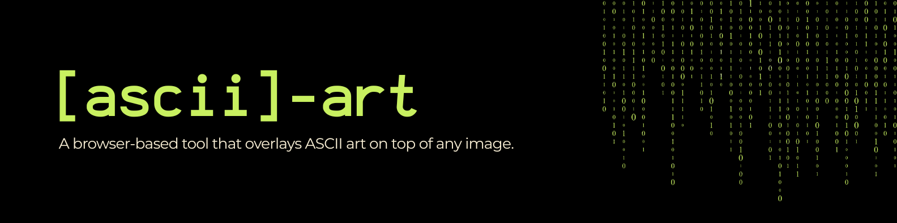
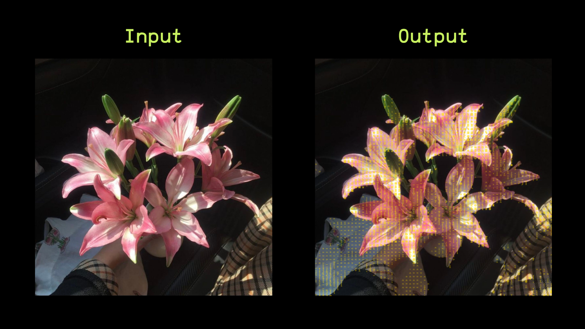
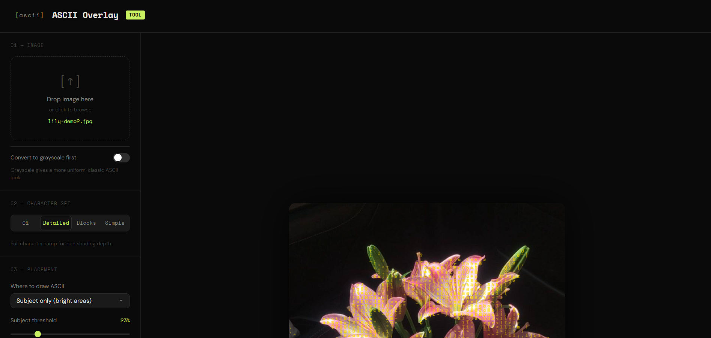
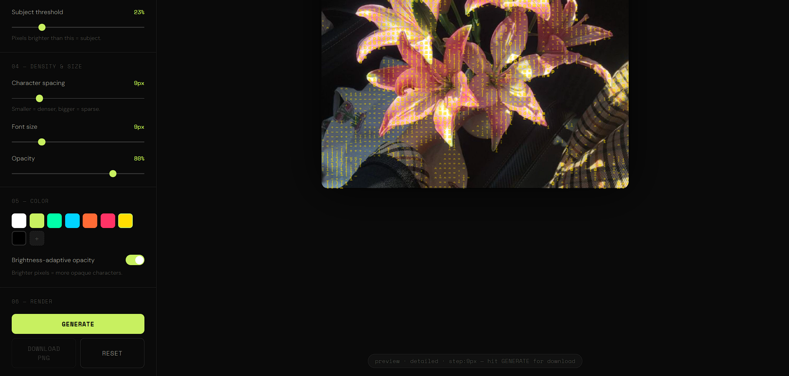

# ascii-art
 
A browser-based tool that overlays ASCII art on top of any image, no installs, no dependencies, runs entirely in your browser.
  

## Features
 
- Upload any image (drag & drop or browse)
- Choose character set: binary `01`, detailed, blocks, or simple
- Control density, font size, and opacity
- Pick where to draw: entire image, subject only, or background only
- Brightness-adaptive opacity for natural shading
- Convert to grayscale before processing
- 8 color presets + custom color picker
- Live preview as you adjust settings
- Download the result as a PNG

## Screenshots

## Stack
 
Vanilla HTML, CSS, and JavaScript

## License
 
MIT
